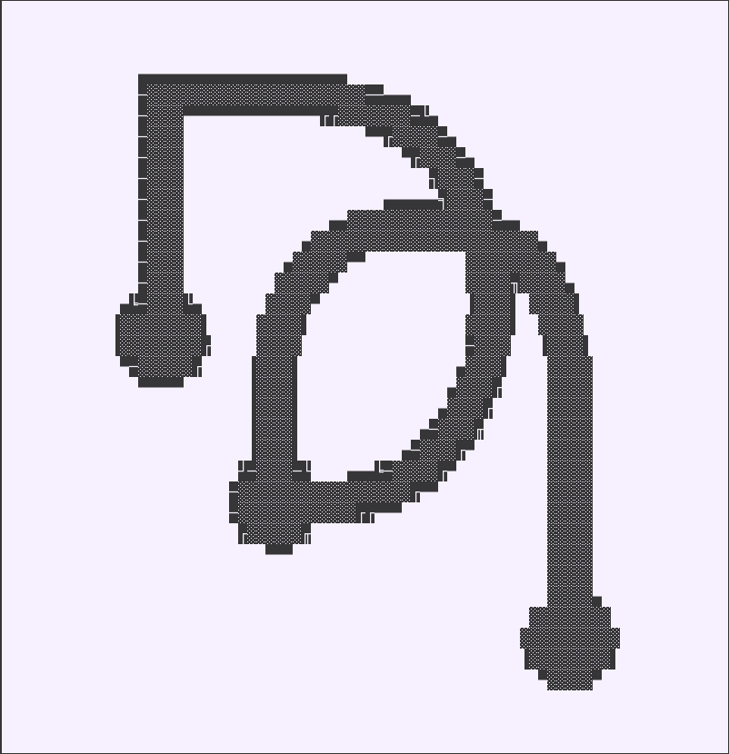

# Monash DeepNeuron ASCII Logo

Creating the Monash DeepNeuron Logo as ASCII art through 2 different methods.

1. String Literal Printing
2. Directly outputting from a `*.txt` file

- Build - `$ bpt build -t :c++20:gcc -o build`
- Run
   1. `$ ./build/mdn-logo-simple`
   2. `$ ./build/mdn-logo-fromfile`
- License - MIT
- [bpt](https://bpt.pizza/docs/latest/index.html)

## Result

